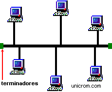
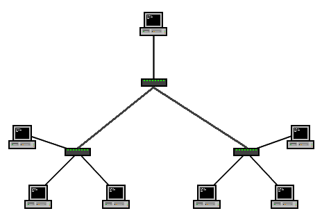

# Clase 3 – Capa de Red y Topologías de Red

## Objetivos de la clase
- Comprender las funciones de la **Capa de Red** en el modelo OSI.
- Diferenciar **direccionamiento lógico (IP)** de **direccionamiento físico (MAC)**.
- Conocer los principales **protocolos de la capa de red** (IP, ICMP, ARP, etc.).
- Analizar las **topologías de red** más comunes y sus características.
- Relacionar el diseño físico/lógico de una red con el rendimiento y la tolerancia a fallos.

---

#  Capa de Red (Nivel 3 del Modelo OSI)

La Capa de Red provee principalmente los servicios de envío, enrutamiento(routing) y control de congestionamiento de los datos (paquetes de datos) de un nodo a otro en la red, esta es la capa más inferior en cuanto a manejo de transmisiones punto a punto.
El propósito de esta capa es el de formar una interfase entre los usuarios de una máquina y la red, esto es, la red es controlada por esta capa y las 2 primeras.
Los servicios que se proveen deberán ser independientes de la tecnologia de soporte.
El diseño de la capa no debe evitar el conectar dos redes con diferentes tecnologias.
La capa de Transporte debe de estar protegida del número, tipo y las diferentes topologias que se utilizen en la subred.
Todo lo que a esta capa le interesa es un camino de comunicación y no la forma en que este se construye.
Se necesita presentar un esquema de direccionamiento para direcciones de la red.

# Funciones clave de la capa de red
## Direccionamiento lógico (direccionamiento IP)

Una de las funciones principales de la capa de red es el direccionamiento lógico, también llamado direccionamiento IP. En la mayoría de las redes modernas, esto se logra mediante el uso de direcciones IP (Internet Protocol, protocolo de internet). Una dirección IP es un identificador único asignado a cada dispositivo en una red, permitiendo que sea reconocido y que otros dispositivos se comuniquen con él.

Las direcciones IP generalmente se representan en notación decimal separada por puntos (ejemplo: 192.168.0.1) para IPv4 o notación hexadecimal (ejemplo: 2001:0db8:85a3:0000:0000:8a2e:0370:7334) para IPv6. Estas se dividen en porciones de red y host, permitiendo un enrutamiento y subnetting eficientes.

La capa de red también distingue entre direcciones IP públicas y privadas. Las direcciones IP públicas son globalmente únicas y asignadas por los ISP, mientras que las direcciones IP privadas se utilizan dentro de redes locales y no son enrutables a través de Internet.

## Enrutamiento y reenvío de paquetes

Otra función crucial de la capa de red es el enrutamiento. Este es el proceso de seleccionar la mejor ruta para que los paquetes de datos viajen desde el dispositivo de origen hasta el dispositivo de destino. Los routers, esto es, los dispositivos principales que operan en la capa de red, utilizan tablas de enrutamiento y algoritmos para tomar decisiones sobre el reenvío de paquetes.

Las tablas de enrutamiento contienen información sobre la topología de la red, incluyendo direcciones de red, el siguiente salto (el siguiente router en la ruta) y la interfaz a través de la cual se deben enviar los paquetes. Los routers intercambian esta información utilizando protocolos de enrutamiento como OSPF (Open Shortest Path First) y BGP (Border Gateway Protocol) para mantener tablas de enrutamiento actualizadas y precisas.

El enrutamiento puede ser estático o dinámico. El estático implica configurar manualmente las tablas de enrutamiento, mientras que el dinámico se basa en protocolos de enrutamiento para actualizar automáticamente las tablas según los cambios y condiciones de la red.

## Fragmentación y reensamblaje

La capa de red también maneja la fragmentación y el reensamblaje de paquetes de datos. Cada red tiene una unidad máxima de transmisión (MTU), que determina el tamaño máximo de paquete que se puede transmitir sin fragmentación. Si un paquete excede la MTU, la capa de red lo divide en fragmentos más pequeños, que se reensamblan en el dispositivo de destino.

La fragmentación es necesaria para garantizar una transmisión de datos eficiente y evitar problemas como la pérdida de paquetes o la congestión de la red. El proceso de fragmentación puede producir sobrecargas en la capa de red, pero es esencial para mantener una comunicación fluida entre dispositivos.
Manejo de errores y diagnósticos

La capa de red es responsable de detectar y manejar errores que puedan ocurrir durante la transmisión de datos. Utiliza protocolos como ICMP (Internet Control Message Protocol, protocolo de mensajes de control de internet) para enviar mensajes de error y realizar tareas de diagnóstico.

El ICMP es utilizado por herramientas como ping y traceroute para probar la conectividad de red e identificar problemas. Ping envía mensajes de solicitud de eco ICMP a un dispositivo objetivo y espera una respuesta, mientras que traceroute mapea la ruta que toman los paquetes desde el origen hasta el destino, ayudando a localizar problemas de enrutamiento.

## ¿Que es un protocolo?

En redes, un protocolo es un conjunto de reglas y convenciones que permiten la comunicación entre dispositivos. Estos protocolos establecen cómo se formatean, transmiten y reciben los datos, asegurando que los dispositivos puedan entenderse entre sí, independientemente de sus sistemas operativos o arquitecturas internas. En esencia, es un lenguaje común para la comunicación en red

Estandarización de protocolos

La estandarización de un protocolo de red es un proceso importante para garantizar que diferentes dispositivos de red puedan comunicarse entre sí de manera efectiva. Esta es necesaria para evitar conflictos y asegurar la interoperabilidad entre diferentes dispositivos de red. El proceso de estandarización de un protocolo de red generalmente comienza con una organización de estándares reconocida, como el Instituto de Ingenieros Eléctricos y Electrónicos (IEEE) o la Organización Internacional de Normalización (ISO). Estas organizaciones establecen comités y grupos de trabajo para desarrollar y revisar los estándares de red existentes o crear nuevos estándares.

Los comités y grupos de trabajo son generalmente compuestos por expertos en el área que representan una variedad de intereses y perspectivas, incluyendo fabricantes de hardware, proveedores de software, usuarios finales y otros interesados en la tecnología de red. Los miembros de estos comités y grupos de trabajo trabajan juntos para definir los detalles técnicos del protocolo de red, como la estructura de los datos, los tipos de mensajes que se pueden enviar y los requisitos de seguridad.

Una vez que se han definido los detalles técnicos, el protocolo de red se somete a un proceso de revisión y comentario público para recibir comentarios y sugerencias de la comunidad de usuarios y desarrolladores de red. Se realizan cambios y ajustes según sea necesario en función de los comentarios recibidos.

Finalmente, el protocolo de red se publica como un estándar y se hace disponible para su uso por parte de los fabricantes de hardware y software de red. Los dispositivos de red que cumplen con los estándares establecidos pueden comunicarse entre sí de manera efectiva y sin conflictos. En conclusión, la estandarización de un protocolo de red es un proceso que involucra a una variedad de expertos y partes interesadas en la tecnología de red.

## Protocolos de la capa de red

Varios protocolos operan en la capa de red, cada uno sirviendo funciones específicas y brindando diferentes servicios. Algunos de los protocolos clave de la capa de red son:

## Protocolo de Internet (IP)

La IP es el protocolo principal en la capa de red, responsable del direccionamiento lógico y el enrutamiento. Define la estructura de las direcciones IP y cómo se asignan a los dispositivos. La IP también especifica el formato de los paquetes de datos, incluyendo los campos de encabezado que contienen información como las direcciones de origen y destino, la longitud del paquete y las banderas de fragmentación.

## Protocolo de mensajes de control de internet (ICMP)

El ICMP (Internet Control Message Protocol) es un protocolo de apoyo utilizado para reportar errores y propósitos de diagnóstico. Define varios tipos de mensajes, como solicitud/respuesta de eco (utilizado por ping), destino inalcanzable, tiempo excedido y mensajes de redirección. El ICMP ayuda a los administradores de red a solucionar problemas de conectividad e identificar problemas de red.

## Protocolo de gestión de grupos de internet (IGMP)

El IGMP (Internet Group Management Protocol) se utiliza para gestionar la membresía de grupos multicast. La multidifusión permite que un solo dispositivo envíe datos a múltiples destinatarios simultáneamente, conservando el ancho de banda de la red. El IGMP permite a los dispositivos unirse o abandonar grupos multicast y ayuda a los routers a rastrear la membresía de los grupos para una entrega eficiente de paquetes.

## Encapsulación de enrutamiento genérico (GRE)

El GRE (Generic Routing Encapsulation) es un protocolo de túnel que encapsula paquetes de la capa de red dentro de otros paquetes de dicha capa. Se utiliza comúnmente para crear redes privadas virtuales (VPN) y permite la transmisión de paquetes entre redes a través de una red pública, como Internet. El GRE brinda una forma segura y eficiente de conectar sitios remotos y extender la conectividad de red.

# Topología de Red: conozca los principales tipos

La topología de red es cómo se organizan los elementos de una red de comunicaciones. La estructura topológica se puede representar física o lógicamente.

En el caso de la topología lógica, los dispositivos de comunicación se modelan como nodos y las conexiones entre dispositivos se modelan como enlaces o líneas entre nodos.

La topología física describe la verdadera apariencia o diseño de la red. Las distancias entre nodos, interconexiones físicas, velocidades de transmisión o tipos de señales pueden diferir entre dos redes, pero sus topologías lógicas pueden ser idénticas.

Al mapear gráficamente estos enlaces, obtenemos algunas formas geométricas que se pueden usar para describir diferentes topologías. Hay ventajas y desventajas para cada uno de ellos, ya que difieren en cómo los dispositivos pueden (o no pueden) interconectarse.

## Tipos de topologías de red

Un administrador de red tiene varias opciones a la hora de elegir qué tipo de topología utilizar. La elección dependerá del tamaño y la escala de su organización, sus objetivos comerciales y su presupuesto.

### Topologia en Estrella

Es el tipo de configuración más común. La red está organizada de modo que los nodos estén conectados a  un dispositivo central (un hub),  que actúa como servidor. El hub gestiona la transmisión de datos a través de la red. Es decir, cualquier dato enviado a través de la red viaja a través del dispositivo central antes de terminar en su destino

Ventajas:

   - Gestión conveniente desde una ubicación central

   - Si un nodo falla, la red aún funciona

   - Los dispositivos se pueden agregar o apartaer sin interrumpir la red

   - Más fácil de identificar y aislar los problemas de rendimiento

Desventajas:

   - Si el dispositivo central falla, toda su red dejará de funcionar.

   - El rendimiento y el ancho de banda están limitados por el nodo central

   - Puede ser costoso de operar

### Topología en Bus

También llamada topología de red troncal, bus o línea, guía los dispositivos a lo largo de un solo cable que se extiende desde un extremo de la red hasta el otro. Los datos fluirán a lo largo del cable a medida que viaja a su destino.

Ventajas:

   - Económico para redes más pequeñas

   - Diseño simple; todos los dispositivos conectados a través de un cable

   - Se pueden agregar más nodos alargando la línea

Desventajas:

   - La red es vulnerable a fallas de cables.

   - Cada nodo agregado disminuye la velocidad de transmisión

   - Los datos solo se pueden enviar en una dirección a la vez.

### Topología en Anillo

Los nodos se configuran en un patrón circular. Los datos viajan a través de cada dispositivo a medida que viajan a través del anillo. En una red grande, es posible que se necesiten repetidores para evitar la pérdida de paquetes durante la transmisión. Las topologías de anillo se pueden configurar como anillo único (half-dúplex) o anillo doble (full-dúplex) para permitir que el tráfico fluya en ambas direcciones simultáneamente.

Ventajas:

   - Costo beneficio

   - Barato de instalar

   - Problemas de rendimiento fáciles de identificar

Desventajas:

   - Si un nudo cae, puede caer varios nudos con él.

   - Todos los dispositivos comparten ancho de banda, lo que puede limitar el rendimiento de trasferencias. 

   - Agregar o eliminar nodos significa tiempo de inactividad para toda la red

### Topología en Árbol

Un nodo central conecta los hub secundarios. Estos hubs tienen una relación de padres-hijos con los dispositivos. O eixo central é como o tronco da árvore.El eje central es como el tronco del árbol. Donde las ramas se conectan son los concentradores secundarios o los nodos de control y luego los dispositivos conectados se conectan a los branches.

Ventajas:

   - Extremadamente flexible y escalable

   - Facilidad para identificar errores, ya que cada branch de la red puede diagnosticarse individualmente.

Desventajas:

   - Si falla un hub central, los nodos se desconectarán (aunque las ramas pueden seguir funcionando de forma independiente)

   - La estructura puede ser difícil de gestionar de forma eficaz

   - Utiliza mucho más cableado que otros métodos

### Topología de Malla (Mesh)

Los nodos están interconectados. Los modos full-mesh  conectan todos los dispositivos en la red directamente. En una topología de malla parcial, la mayoría de los dispositivos se conectan directamente. Esto proporciona múltiples rutas para la entrega de datos. Los datos se envían a la distancia más corta disponible para la transmisión.

Ventajas:

   - confiable y estable

   - Ningún fallo de un solo nodo desconecta la red

Desventajas:

   - Grado complejo de interconectividad entre nodos.

   - Mano de obra intensiva para instalar

   - Utiliza mucho cableado para conectar todos los dispositivos.

### Topología Híbrida

Utiliza varias estructuras de topología. Esto es más común en organizaciones grandes donde cada departamento puede tener un tipo de topología, como estrella o línea, con el hub del departamento conectando a um hub central.

Ventajas:

   - Flexibilidad

   - Puede personalizarse según las necesidades del cliente.

Desventajas:

   - La complejidad aumenta

   - Se requiere experiencia en múltiples topologías

   - Puede ser más difícil determinar los problemas de rendimiento.

## ¿Qué topología es mejor para su red?

No existe una respuesta correcta o incorrecta a la pregunta de qué topología es mejor para su red. En muchos casos, todo se reduce al nivel de comodidad y la cantidad de redundancia que necesita.

El costo también juega un papel. Cuantos más cables necesite y más compleja sea la topología, más costosa y lenta será su instalación y administración.

Sea cual sea su elección, es importante que planifique con anticipación. A medida que las necesidades comerciales cambian y evolucionan, es probable que deba agregar, eliminar o cambiar dispositivos. Dependiendo de su elección, puede ser más fácil (o más difícil) dimensionar. Una de las razones por las que muchas organizaciones eligen topologías en estrella es porque es fácil realizar cambios sin interrupciones significativas.

